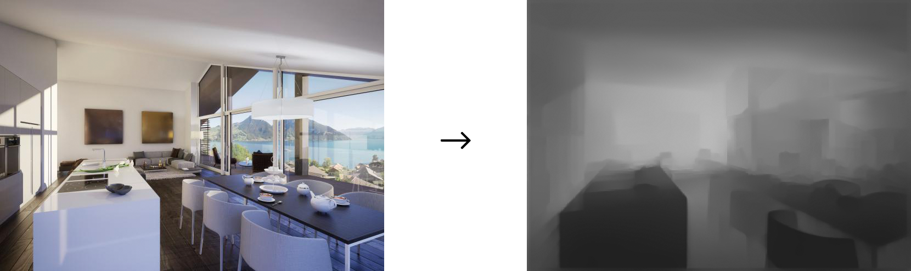

# AI based 3D Image generator
This project was created in the course **Computational Perception extended COMPPX** from Digital Ideation at HSLU.

#### Students
* [Miro Bossert](https://github.com/mirobossert)
* [Fabien Jeckelmann](https://github.com/fabjeck)
* [André Lergier](https://github.com/andre-lergier)

## Idea / Target :dart:
The entire group was amazed by the possibilities of machine learning in image processing. Using [RunwayML](https://runwayml.com/), we could try out different models with different inputs and decided later to create a something using the depth of an image. We had ideas like generating a bokeh portrait effect or an interactive 3D depth effect. 
Because quite every smartphone today can create those fake portrait images, we decided to focus on the 3d depth effect idea. We wanted to create something fancy showing people what an AI can do.

For us it was clear, that it should be a program running in a browser so you don't need to install an extra software.

## Process :books:
After some research we started to put our ideas into code.

#### Layers of the Network
`Miro`

#### Transform model to TensorflowJS
Our first and biggest problem was to transform the DensDepth model to TensorflowJS, so we could use it in the browser without any big dependency.

#### Training the model
`Miro`

#### Generating the depth map
Thanks to the runway HTTP Server we can use our needed model from the browser.
With some lines of Javascript we can send an image as a blob from the browser to RunwayML. Runway then generates a depthmap of the sent image. The depthmap is an image with the same dimensions as the input image but is just in grayscale. As closer to the camera objects are, the darker they are on the depthmap image - as further away, the lighter they are.

**Example**


## Webapplication :computer:
We developed a web application using [Vue.js](https://vuejs.org/).
As a first step the user can upload an image from its computer. As soon as the browser created a blob of the image, the application sends the image to runway and gets back the depthmap of the image.
Using WebGL we project the original image on the canvas element. In the shaders, we can recalculate the value of each pixel with the depthmap and the current mouse position. That's actually the magic - if the neural network was able to create an accurate depthmap, the effect is quite nice. :tada:

## Usage :electric_plug:
To run the project locally, you have to run the following commands.
Additionally it's necessary to run [RunwayML](https://runwayml.com/) with a [DenseDepth](https://github.com/agermanidis/DenseDepth) model. In there you need to go to `Network` and make sure the HTTP Server Address is `http://localhost:8000`. If you use an other port, you have to change that in the file [`src/components/DepthImage.vue`](src/components/DepthImage.vue).

### Project setup
```sh
cd path/to/your/target/directory/...
```
```sh
git clone https://github.com/andre-lergier/hslu-comppx.git
```
```sh
npm install
```

#### Compiles and hot-reloads for development
```
npm run serve
```

#### Compiles and minifies for production
```
npm run build
```

#### Lints and fixes files
```
npm run lint
```

## References :bulb:
* [Runway ML](https://runwayml.com/)
* [DenseDepth Model](https://github.com/ialhashim/DenseDepth)
* [DenseDepth Model (for Runway)](https://github.com/agermanidis/DenseDepth)

* [Mannequin Challenge Code and Trained Models](https://github.com/google/mannequinchallenge)
* [This AI Learns About Movement By Watching Frozen People](https://www.youtube.com/watch?v=prMk6Znm4Bc)
* [Tympanus - How to Create a Fake 3D Image Effect with WebGL](https://tympanus.net/codrops/2019/02/20/how-to-create-a-fake-3d-image-effect-with-webgl/)
* [Tympanus - Animated Heat Distortion Effects with WebGL](https://tympanus.net/codrops/2016/05/03/animated-heat-distortion-effects-webgl/)
* [Medium - Background Removal in Real-Time](https://medium.com/@jmlbeaujour/real-time-matting-of-webcam-video-on-the-browser-part-1-2c71a330ed08#7a95)
